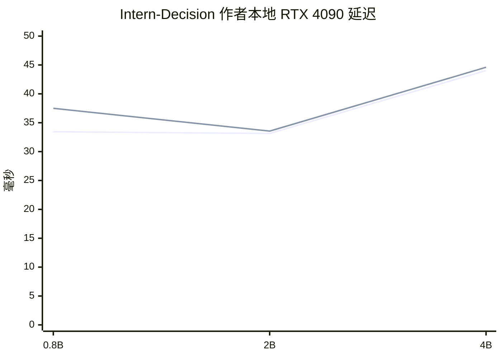

# PoL2 治理层 System‑One 模型选型深度调研

**调研截止日期：2026-09-29（Asia/Tokyo）**  
**总体结论置信度：中高。模型硬门槛与工程路线判断：高；PoL/中文实际质量排序：中低，因为本轮没有下载大权重、没有调用付费 API，也没有在统一 PoL 封存集上运行任何候选。**

## 执行摘要与一页结论

### 结论

按你给定的硬门槛重新筛选后，我建议**首轮实验保留五条路线，但只有前三个值得优先投入工程时间**：

| 优先级 | 候选 | 推荐用途 | 推荐强度 | 为什么进入 | 当前最大风险 |
|---|---|---|---|---|---|
| **第一梯队** | **Laya multilingual 322M** | 超轻/CPU 主筛查；多条 PoL typed decisions 一次前向 | **强** | 真正非自回归 System‑One；多语言；Apache‑2.0；本地 CPU/GPU；有完整训练、校准和 ONNX 路线；多个问题可在同一 forward 中处理。citeturn21search6turn2search0 | 出厂 typed-decision 泛化并不强；作者自己的结果显示需要领域训练与重新校准，长上下文也会退化。citeturn2search0turn21search2 |
| **第一梯队** | **Intern‑Decision‑0.8B** | PoL 主判定器候选；复杂条件/例外/多问题 | **强，但证据新** | 真正单 forward 多问题；无自由文本生成；Apache‑2.0；训练、校准、推理、导出/验证代码都公开；单 RTX 4090 有完整 p50/p95 作者实测。citeturn19search0turn19search1 | 项目只发布几天，独立复现极少；原始训练数据和私有校准记录没有公开；中文 PoL 没有公开成绩。citeturn19search1 |
| **第一梯队** | **Shieldstral‑1.0‑3B** | 策略自适应深度复核；长上下文；PoL 条款逐条问询 | **强** | Mistral 官方开放权重 Apache‑2.0；明确支持中文；自然语言政策；单 forward 读 `yes/no` logits；32k 训练上下文；官方 Axolotl LoRA 路线约 10.6 GiB VRAM。citeturn17search0turn13search1 | 一项 policy 一次 query，8/32 条 PoL 判断可能变成 8/32 个 forward；而且它的训练先验仍是“安全审核”，可能把正当愤怒/批评误判成风险。 |
| **第二梯队** | **CLM‑v0.1‑8B** | 深度 action ranking：`allow / clarify / revise / block / escalate` | **有条件强推** | 正宗 System‑One 对比学习路线：冻结 Qwen3‑8B，训练 state/action projection heads；action 可缓存；Apache‑2.0；训练代码公开；独立量化复现已经发现非常具体的 4-bit 退化。citeturn9search0turn9search2turn20search0 | 公开 checkpoint 标记为 English，中文 PoL 未验证；推理仍要跑 8B backbone；概率只相对于当前候选集合，不是绝对正确概率。citeturn9search2turn20search0 |
| **限定用途** | **GLiNER2.5‑multi‑Decide 287M** | Tier‑0 CPU 路由、明显案例筛查，不作唯一 PoL 裁判 | **中** | 多语言、运行时动态标签、单 forward、CPU-first、Apache‑2.0；本地完整训练/LoRA/JSONL 工具链公开。citeturn14search3turn18search0 | 官方自己明确说它不是通用推理模型；其公开 Decide benchmark 是英语业务分类，不能证明能处理同意撤回、反事实、关系操控等 PoL 语义。citeturn14search3 |

**我的首选不是某一个模型，而是先让 `Laya multilingual` 与 `Intern‑Decision‑0.8B` 正面对打。** Laya 是最便宜、最容易形成 CPU/边缘路径的真正 typed System‑One；Intern‑Decision 更像“把一个小型 Qwen 变成真正多问题 decision machine”，容量和复杂语义上更有潜力。Shieldstral 应作为第三条独立路线，因为它直接验证“PoL 是否其实更适合 policy-adaptive guard，而不是 Jev-like typed head”。

CLM 应该认真测，但我**不再把它直接排进前三**。它的结构非常适合“当前上下文下应该采取哪个治理动作”，可它公开 checkpoint 的中文证据为空，同时 8B encoder 对常驻运行时治理层并不便宜；另外，CLM 的 softmax 是候选集合内部相对概率，候选集合一变，所谓 `0.9` 的语义就跟着变。citeturn9search2turn20search0

GLiNER2.5‑multi‑Decide 则只应作为 **Tier‑0**。把它用于“明显应该升级”“明显无风险”“主题/权限/工具类型路由”很合理；让它单独判断“温柔措辞下的操控”和“愤怒但正当的拒绝”则证据不足。官方模型卡本身就把它定位为 operational decision specialist，而不是一般推理器。citeturn14search3

### 一个重要的门槛解释

本报告默认把“**能处理中文上下文**”解释为：

> 架构和 tokenizer 不把中文排除在外，并且存在真实可执行的中文领域训练路径；**不要求发布 checkpoint 已经有 PoL 中文成绩**。

这是因为我们选的是“要继续训练的候选”，不是零样生产模型。若把门槛改成“**发布 checkpoint 必须已经有公开中文治理实测**”，那么严格名单会明显缩短：Shieldstral 有明确中文支持，Laya 有多语言路线；Intern‑Decision 和 CLM 都应暂时降到观察项。Shieldstral 官方列出中文在 12 种支持语言之内；Laya multilingual 明确面向 100+ 语言。citeturn17search0turn21search6

### 上一轮结论需要修正的地方

最重要的修正有三个。

**NanoJev 暂不能进默认名单。** 它技术上非常漂亮：Qwen3‑0.6B、typed heads、完整训练 pipeline、MIT 代码；但公开材料没有给训练后权重一个足够明确的权重许可证。独立转换者也明确把这一点标成“upstream weights no declared license”，另一个转换项目因此没有重新分发转换后的权重。按你的规则，“代码开源不能代替权重许可”，所以它现在必须退出默认名单。citeturn6search0turn6search2turn6search9

**Kev‑4B 和 JevK5 不应因为技术上好用就自动进中文 PoL 前五。** Kev 的训练配方、LoRA、pointer head 和代码都非常扎实，但当前卡明确标注 English；JevK5 也以英语工作负载为主。它们应该是 Jev-like 强基线，而不是在没有中文验证时占掉正式名额。citeturn21search0turn12search0

**Shieldstral 应从“普通安全 baseline”上调。** 它不是传统生成式 guard：Mistral 官方实现实际上在最后位置直接读 `yes/no` logits，一次 forward 得出 score；而且官方提供自然语言 policy 与 LoRA 训练路径。它不具备 Jev/Laya 那种多字段 typed API，但在本任务里已经足够接近 System‑One，需要正式参赛。citeturn17search0turn13search1

本轮已阅读你上传的既有候选清单与研究报告；它们本身也明确说明上一轮没有做本地推理/训练实测。fileciteturn0file0 fileciteturn0file1 当前执行环境中 `/mnt/data` 只有这两个文件，**没有 `SPEC.md`**；`C:\Projects\DAism\NaturalDAO\PoL` 也没有挂载，因此本轮没有假装重新读到中文 PoL 第 1–5 章。已有 `report.md` 包含上一轮对本地中文稿的摘录与工程解释，但它属于二手项目研究记录，而不是本轮重新核验原文。fileciteturn0file1

## 研究边界、硬门槛与第一性原理

### 第一性原理

PoL 治理层真正要决定的不是“这段话是不是友善”，而是：**在当前事实、关系、权限、持续同意和具体行动下，下一步能不能执行；若不能，应该澄清、修改、暂缓、阻止还是升级复核。**

因此模型最重要的能力不是长文本生成，而是**条件化判定**：同一句行为在 consent、主体关系、引用语境、例外条款或工具权限发生变化时，结论应能稳定翻转。一个治理模型即使安全分类 F1 很高，只要会把愤怒的受害者误拒、把温柔的操控放行，仍不适合 PoL。

最终生产指标也不应该是单纯 accuracy，而应是：**在限定严重错误率的前提下，自动处理覆盖率能有多高，以及错误是否可校准、可升级、可回放。**

### 证据等级

报告使用以下标签：

| 标签 | 含义 |
|---|---|
| **一手可查** | 模型发布者自己的 GitHub、HF 权重/模型卡、官方文档、训练脚本、许可证或论文 |
| **独立复现** | 与原作者不同的开发者实际转换、量化、运行或训练，并公开具体测量 |
| **作者自报** | 发布者自己的 benchmark、latency、校准结果；可复现但本轮没有复跑 |
| **推断** | 从架构、参数量和公开实现推出的工程判断，不冒充实测 |
| **未知** | 没有可靠证据，或者当前检索没有获取到 |

Han Xiao 的索引非常适合 discovery，但不适合拿来当验证。当前索引页面显示约 1,234 个总条目，其中 Model 类约 209 个，最近一次页面标注 sweep 为 2026‑09‑24；其中还混有 runtime、app、paper、interpretation 等，不能把条目数解释为 209 个独立可训练模型。citeturn0search15

### 硬门槛核查

| 硬门槛 | Laya multi | Intern‑Decision 0.8B | Shieldstral 3B | CLM 8B | GLiNER multi‑Decide |
|---|---|---|---|---|---|
| 开放权重、本地运行 | **通过** | **通过** | **通过** | **通过** | **通过** |
| 修改/训练/衍生发布许可 | **通过：Apache‑2.0** citeturn21search6 | **通过：Apache‑2.0 + 上游 Qwen notices** citeturn19search0 | **通过：Apache‑2.0** citeturn17search0 | **通过：Apache‑2.0** citeturn9search2 | **通过：Apache‑2.0；mDeBERTa 上游 MIT** citeturn14search3turn14search10 |
| 真实训练路径 | **通过** | **通过** | **通过** | **通过** | **通过** |
| 结构化而非自由文本主输出 | **通过** | **通过** | **通过，二元 score** | **通过** | **通过** |
| 中文/多语言可适配 | **明确通过** | **技术通过、中文质量未知** | **明确通过，官方列中文** | **可训练但发布卡为 English，风险最高** | **明确 multilingual** |
| 统一映射到 score/decision | **通过** | **通过** | **通过** | **通过，但是候选相对分数** | **通过** |
| CPU 或单消费级 GPU 部署路径 | **CPU/GPU** | **单 RTX 4090 已有作者实测** | **单 16GB GPU + llama.cpp** | **8B，本地 GPU/MLX/GGUF，但较重** | **CPU/GPU** |

Laya、Intern、Shieldstral、CLM、GLiNER 的上述结构性结论分别来自官方仓库/模型卡；其中 CLM 的轻量量化风险已有独立复现，而 Laya 也已有第三方 ONNX/FP8 量化测量。citeturn19search0turn17search0turn20search0turn21search9turn21search13turn18search0

### 指定权重下的排序

你指定的权重为：

**PoL/中文质量 30%｜延迟/资源 25%｜训练可复现性 20%｜鲁棒/校准 15%｜维护与独立证据 10%。**

目前没有统一 PoL 数据、统一硬件和统一 workload 的实测，因此给一个 `83.7` 之类的总分会是伪精确。我按上述权重做**定性加权等级**：

| 候选 | PoL/中文 30% | 资源 25% | 可复现 20% | 校准/鲁棒 15% | 生态 10% | 加权判断，不是 benchmark 分数 |
|---|---|---|---|---|---|---|
| **Laya multi 322M** | 中高 | **高** | **高** | 中高 | 中高 | **A− / B+，中等置信** |
| **Intern‑Decision 0.8B** | 中 | **高** | 高 | 中高 | 低中 | **A− / B+，中低置信** |
| **Shieldstral 3B** | **高** | 中 | **高** | 中高 | 中高 | **B+ / A−，中等置信** |
| **CLM 8B** | 中低至中 | 中低 | 高 | 中 | 中高 | **B， 中等置信** |
| **GLiNER multi‑Decide** | 中低 | **高** | **高** | 低中 | 高（底座）/低（新 Decide checkpoint） | **B−，仅 Tier‑0** |

这里的“高/中/低”表示**当前证据支持度和工程适配度**，不是实际 PoL 准确率。

权重敏感性很清晰：若把 PoL/中文质量权重提高到 40% 以上，Shieldstral 会明显上升；若把延迟/资源提高到 35% 以上，Laya/GLiNER 占优；若要求每次同时评估 32 个独立规范，Shieldstral 会显著吃亏，而 Laya/Intern 受益；若本地硬件允许常驻 24GB GPU、并且最终治理输出主要是有限 action ranking，CLM 的位置会上升。

以下是我认为最值得验证的组合假设，而不是既定架构：

## 完整长名单与淘汰结果

这里的“完整”指本轮实际进入 hard-gate audit 的相关长名单，不声称逐个审核 Han Xiao 索引中的全部 209 个 Model 条目。量化版、GGUF、MLX、ONNX、同模型 API 转售和 alias 均不另计为模型。

| 模型/项目 | 去留 | 主要理由 | 证据 | 什么新证据会改变结论 |
|---|---|---|---|---|
| **Laya multilingual 322M** | **入围** | Apache；mmBERT；多语言；真正非自回归多问题决策；CPU；完整训练/校准。citeturn21search6turn2search0 | **一手可查 + 独立复现** | 若中文 PoL 微调后仍明显输给普通 0.8B LLM，或长上下文/量化导致不可接受的 flip，则降级 |
| **Intern‑Decision‑0.8B** | **入围** | Qwen3.5 派生；一次 causal forward 读取多个 `<decision>` 位；Apache；训练/评估/校准代码齐。citeturn19search0turn19search1 | **一手可查 / 作者自报** | 中文 PoL 失败、XTuner 训练链无法在项目硬件上稳定重现，或独立复现揭示 benchmark contamination |
| **Intern‑Decision 2B/4B** | 同家族扩容 ablation，不另计 | 2B/4B 有相同接口和训练路线；4B 作者 benchmark 更高但更重。citeturn19search0turn19search3 | **一手可查 / 作者自报** | 若 0.8B 明显达不到 PoL 精度而 2B/4B 带来显著增益，可升级正式 checkpoint |
| **Shieldstral‑1.0‑3B** | **入围** | 中文、32k、自然语言 policy、单 forward yes/no logits、Apache、官方 LoRA。citeturn17search0turn13search1 | **一手可查** | 若多政策 8/32 forward 的 p95 不可接受，或正当批评误拒显著高，则退为 safety baseline |
| **CLM‑v0.1‑8B** | **入围，有条件** | 冻结 Qwen3‑8B + state/action projection；InfoNCE；action cache；官方 fine‑tune；Apache。citeturn9search0turn9search2 | **一手可查 + 独立复现** | 若中文 PoL action ranking 不达标或 8B latency 超预算则淘汰；若出现 1–3B 中文 CLM 同构权重可重新排序 |
| **GLiNER2.5‑multi‑Decide 287M** | **入围，限定 Tier‑0** | 多语言动态分类；CPU-first；单 forward；本地 trainer/LoRA。citeturn14search3turn18search0 | **一手可查** | 若 PoL minimal-pair 证明能处理复杂撤回/例外而非标签匹配，可升级；反之只做路由 |
| **Kev‑4B** | **近失，强基线** | LoRA r=16 + pointer head；Apache；训练路径扎实；但当前 checkpoint 明确 English，而且 Qwen3.5 recurrent 层导致问题以独立 causal rows 处理，并非“任意多问题零增量”。citeturn21search0turn1search15 | **一手可查** | 一次中文 PoL fine‑tune + sealed test 达标即可重新进入前五 |
| **Kev‑0.8B** | 家族 ablation | 更小但公开 hard benchmark 明显弱；不是独立架构。citeturn1search4 | **一手可查 / 作者自报** | 若 PoL 专训后表现优于 4B 成本曲线 |
| **JevK5 4B v0.3** | **近失** | Apache、明确 rank‑16 LoRA 训练和 SemIf-style candidate-token logits；但当前英语为主；训练语料中还涉及闭源模型生成 teacher outputs，原始复现的数据供应链更复杂。citeturn12search0 | **一手可查** | 中文 PoL 专训复现 + 数据许可重建干净后可晋级 |
| **NanoJev 0.6B** | **硬门槛淘汰** | 架构和训练路径很好，但当前训练后权重许可证不够明确；MIT 代码不能自动给权重授权。独立转换者也明确标注此问题。citeturn6search0turn6search2turn6search9 | **一手可查 + 独立核验** | 作者为训练权重明确补充 MIT/Apache 等可衍生许可证 |
| **Bosun v3.1 0.6B / 1.7B** | **观察** | Qwen3 + LoRA + learned decision tokens，Apache；但训练数据未随 release 发布，当前主要英语，复现链不够完整。citeturn7search0turn7search1turn8search2 | **一手可查 / 作者自报** | 发布训练代码/数据或可替代的数据配方，并出现中文 PoL 结果 |
| **Verdict / rlcd-modernbert‑151m** | **观察** | 很轻、Apache、CE+Brier/温度校准路线明确；但 ModernBERT/当前任务基本英语，早期 context 很短，不足以满足中文 PoL 主判定。citeturn4search0turn4search3 | **一手可查** | 出现 multilingual encoder 版本和中文 PoL 微调复现 |
| **Verdict 2.0** | **观察** | 训练 runbook 很完整，甚至公开 GTX 1660 Ti 6GB 训练路线；但中文证据与权重分发路径成熟度不足。citeturn4search0turn4search3 | **一手可查 / 作者自报** | 正式稳定 HF 权重 + 中文/长上下文实测 |
| **AlexWortega/openjev** | **观察** | MIT；Qwen3.5 NLI；三分类 CE、训练/评估代码开放；但它更像 NLI 关系模型，多 policy 可能需要多 hypothesis forward，且作者自己的攻击测试显示 injection 会显著伤害效果。citeturn10search6 | **一手可查 / 作者自报** | 中文 PoL NLI minimal-pair 与 1/8/32 query 吞吐达到要求 |
| **openjev/openjev 27B** | **硬门槛淘汰** | helper/code 开放不等于权重开放商业使用；权重为 **CC BY‑NC 4.0**，违反默认商业/衍生发布门槛。citeturn10search0 | **一手可查** | 权重重新以允许目标使用/衍生发布的许可证发布 |
| **TypeSafe Jev 1.13.0** | **外部基线，不是候选** | `jev-latest` / `jev-preview` 是 alias；公开权重不可得，当前无客户 LoRA/fine‑tuning，本地自主部署不成立。已有项目清单也已核过此点。fileciteturn0file0 | **一手资料经既有研究核查** | TypeSafe 正式发布可本地部署权重及可训练许可证 |
| **Qwen3Guard Gen / Stream** | **安全 baseline** | 有价值的中文/安全对照，但任务形态与纯 System‑One bounded decision 不同；不占最终名额。fileciteturn0file0 | **一手资料经既有研究核查** | 若推出真正 logits-only / classification checkpoint 且开放训练链，可重新审 |
| **Llama Guard** | **安全 baseline** | 用于一般安全 regression，不等同 PoL；许可证与任务结构也需独立处理。fileciteturn0file0 | **一手资料经既有研究核查** | 出现更轻、policy-adaptive、中文和开放训练版本 |
| **SemIf** | **必须保留的普通 LLM logits baseline** | 是推理框架/读出方法，不是新的训练权重；不能作为一个“新模型”重复计数。fileciteturn0file0 | **一手可查** | 不适用；它的价值正是作为无专用 decision fine‑tune 对照 |
| **Tacet / Mapika Decider / Lev / system‑one‑open / Certo / VTX‑JEV‑1 / CUA‑S1 等** | **观察池** | Han Xiao 索引确认生态中还有这些方向，但本轮没有为每个项目同时拿到“权重许可 + 中文 + 训练入口 + 独立复现”完整证据链；不能因为名字像 Jev 就晋级。citeturn0search15 | **索引一手/证据不足** | 任一项目补齐四项 hard-gate 证据后应重新审计 |

这张表也解释了为什么**模型名称不能当路线分类**。Kev/JevK5/NanoJev/Bosun 都是 Jev-like，却分别使用 pointer head、candidate-token readout、decision heads、learned decision tokens；CLM 完全不叫 Jev，却更接近“System‑One state → bounded action distribution”的第一性结构。GLiNER 又是动态 schema classifier；Shieldstral则是 policy-conditioned yes/no score。

## 入围模型对比与深析

### 总体对比

| 维度 | Laya multilingual | Intern‑Decision‑0.8B | Shieldstral‑1.0‑3B | CLM‑v0.1‑8B | GLiNER2.5‑multi‑Decide |
|---|---|---|---|---|---|
| 精确模型 | `convaiinnovations/laya-multilingual` | `internlm/Intern-Decision-0.8B` | `mistralai/Shieldstral-1.0-3B` | `Contrastive-LM/CLM-v0.1-8B` | `fastino/GLiNER2.5-multi-Decide` |
| 当前可固定 revision | HF 当前树显示 `e4e9ddf` citeturn21search6 | 本轮抓取器未返回 HF SHA；**运行前必须 resolve/pin** | 独立转换记录 upstream `b6073e…`，正式实验前需向官方 HF 再核 hash citeturn16search4 | v0.1；本轮未可靠提取 commit SHA，正式实验前必须 pin | `9239a7d15f46e2465ca9254e367349597330d8e6` citeturn14search3 |
| 参数 | 322M | HF 显示约 0.9B tensors | 官方称 3B | Qwen3‑8B + 约 20M projection heads | 287M |
| 底座 | mmBERT-base | Qwen3.5‑0.8B | Ministral‑3‑3B‑Base‑2512 + Pixtral vision | Qwen3‑8B | mDeBERTa‑v3‑base |
| 判定机制 | 双向 encoder + typed decision head；多问题一 forward | JSON skeleton + `<decision>` markers；读每个 marker 前的候选 token logits | 最后位置 `yes/no` logits | state/action 分开 embedding + contrastive projection + cosine/ranking | schema-conditioned classification head |
| 自由文本生成 | 无 | 无 | 实际产品路径只读一个 token 的 logits | 无 | 无 |
| 多问题成本 | 多问题同 forward | 1–16 questions 同一 causal forward | **每 policy 一 query/forward**；可 batch | action 可缓存，state 只需编码；候选数对 dot-product 很便宜 | 多个 classification heads 可同 schema 运行 |
| 中文 | 明确 multilingual | **未公开 PoL 中文实测** | **官方明确中文** | checkpoint 标记 English；需中文 fine‑tune 验证 | 明确 multilingual |
| 默认/训练上下文 | 1024；可至 8192，但 >4k 稳定性下降 citeturn21search2 | 默认 max 8192，超长拒绝而非静默 truncate citeturn19search0 | 训练至 32k；理论更长但官方建议 ≤32k citeturn17search0 | 官方 serving 默认约 2048，可调更高；长状态需明确 truncation | Decide 卡未给稳定 PoL 长上下文；底座 boundary 最大窗口更长，但必须实测 |
| 训练路线 | 全 encoder/head；已有 proper-scoring/RLCD notebook | 官方 XTuner 全 language backbone；冻结 vision | 官方 Axolotl LoRA | 官方 `train/finetune.py`，冻结 encoder，训练 projection heads | `gliner2[train]`，full/LoRA |
| 初版是否需要 RL | **不需要** | **不需要** | **不需要** | **不需要，InfoNCE/CE 类目标** | **不需要** |
| 校准现状 | 出厂明显过置信；温度缩放改善很大 | 每 checkpoint 独立 NLL temperature；有 Brier/ECE harness | 官方称 calibrated score，但 PoL/中文必须重校准 | candidate-relative softmax；不能当 absolute correctness | threshold/score 有，但完整 PoL calibration 未见 |
| CPU 路线 | **强** | 官方路径主要 CUDA | llama.cpp 有 CPU 路线，但 3B | GGUF/MLX 有，但 8B 较重 | **强** |
| 单消费级 GPU | 很容易 | RTX 4090 有作者实测 | 官方 16GB BF16 | 建议 24GB 级或量化；4-bit 风险大 | 很容易 |
| 权重许可 | Apache‑2.0 | Apache‑2.0 / Qwen notices | Apache‑2.0 | Apache‑2.0 | Apache‑2.0 |
| 独立证据 | 多个量化/ONNX/finetune | **很少，过新** | 多个 GGUF/ONNX/MLX conversion；PoL 无独立实测 | **较强：MLX/GGUF parity 与量化 degradation** | 基础生态成熟；multi-Decide 本身很新 |
| PoL 最大杀手风险 | 小 encoder 学不会关系和例外 | 中文/训练数据 provenance 未知 | safety 先验导致过度拦截 | 8B 成本 + 中文 + candidate-set probability | 变成“聪明标签匹配”，不是真规范判断 |

相关一手资料分别见 Laya、Intern‑Decision、Mistral、CLM、GLiNER 官方卡与仓库。citeturn2search0turn19search1turn17search0turn9search0turn18search0

**Laya multilingual。** 这是我目前认为最适合做 PoL **第一层真实训练实验**的模型，不是因为它零样本最好，而恰恰因为它的失败边界比较透明。它用 mmBERT-base 双向 encoder 和 decision head，运行时问题与 options 都参与输入，可以在同一 forward 里做 `choice / score / noul` 类型判断。公开 checkpoint 322M、Apache‑2.0，默认 1024 context，可提高到 8192；作者实测在约 4k 文本之前仍相对稳定，之后结果波动明显。citeturn21search6turn21search2 **【一手可查】**

它最值得注意的不是“RLCD”这个标签，而是**作者自己承认 base multilingual 在 typed-decisions 上接近弱基线，fine-tuned typed model 才显著改善**。这对 PoL 其实是好消息：说明不能用“100+ languages”偷换“理解 PoL”，必须训练。Laya 还公开展示过温度校准将 English ECE 从约 0.466 降至 0.081、multilingual 从约 0.314 降至 0.106；这再次说明原始 softmax 不能直接当概率。citeturn2search0 **【作者自报】**

第三方 ONNX 转换报告 FP16 与 FP32 很接近，但 INT8 最大相对输出误差可达约 14.4%；另一个 FP8 复现在小型 XNLI 样本中报告中文 decision agreement 约 96%。两者都不是 PoL benchmark，却证明“量化后必须重跑 calibration”不是理论上的洁癖。citeturn21search9turn21search13 **【独立复现】**

**可能使 Laya 出局的问题：** PoL 的难点不是银行意图，而是多轮关系状态。若经过 PoL 专训后，它仍无法稳定处理“之前同意、现在撤回”“对行为的愤怒批评 ≠ 对人的贬损”“礼貌语气下的排他操控”等 minimal pairs，那么 322M encoder 的速度优势没有意义。

**Intern‑Decision‑0.8B。** 这是当前最值得挑战 Laya 的 Jev-like 小模型。它不是 pointer head，而是把完整 assistant JSON skeleton 放进输入，在每个字段位置放一个 `<decision>` marker，训练时用普通 causal CE 让 marker 前一个位置预测单 token 选项；推理一次 forward 后，分别读取各 marker 的候选 logits。一个 request 可含 1–16 个问题，每题最高 62 个候选，默认拒绝超过 8192 token 的输入。citeturn19search0turn19search1 **【一手可查】**

它的训练链比多数新 System‑One 项目完整：XTuner 配置、JSONL schema、checkpoint verification、校准收集/拟合、benchmark replay、HF/XTuner 两条 inference backend 都公开；Qwen3.5 language backbone 被 fine-tune，vision tower/projector 冻结。问题在于**发布者没有公开原始训练数据、私有 calibration/validation records 和图像数据**，所以你可以训练自己的 PoL 版，却不能完全审计原 checkpoint 为什么得到当前成绩。citeturn19search1 **【一手可查】**

作者在同一张 RTX 4090、本地 HF 路径报告 0.8B p50 约 33.44ms、p95 37.50ms；2B 反而与其接近，4B p50 约 44.03ms。这至少说明“小两倍参数就一定快两倍”是不可靠的判断。citeturn19search0 **【作者自报】**

上图第一条线为 p50、第二条为 p95；只比较同一 Intern 家族、同一作者 workload，**不能与 Laya/Shieldstral/CLM 横向当 benchmark**。citeturn19search0

Intern‑Decision 还提供独立 temperature preset：0.8B 温度约 2.748，是在 1,728 calibration cases 上以 NLL 拟合，另有 1,693 validation cases；公开测试标签没有用于选温度。citeturn14search1 **【作者自报】** 但训练数据不可见，因此“benchmark 没有污染”仍然不能保证，正确表述是**测试温度选择协议公开，训练语料污染未知**。

**可能使 Intern 出局的问题：** 新项目生态太薄；如果我们的中文 PoL fine-tune 出现明显 option-order 敏感性、prompt injection 或单 GPU 训练链不稳定，就不该因作者 benchmark 漂亮而坚持。

**Shieldstral‑1.0‑3B。** Mistral 在 2026‑08‑04 发布，官方定位就是 3B policy-adaptive multimodal safety classifier。输入由 `<Instruct> / <Query> / <Document>` 构成，实际分类直接读最后位置的 `yes/no` logits 并重新归一化；不是长文本生成。官方列出中文、日文、韩文等 12 种语言，训练长度至 32k，并建议不要把理论 256k 当作已训练稳定范围。citeturn17search0 **【一手可查】**

它对 PoL 的价值在于**规范可以留在外部文本中**。这比把所有 PoL 版本和边界一次性烧进 checkpoint 更适合仍在演化的协议。Mistral 还说明训练时会变化 instruction/query phrasing，并构造相近但边界不同的 policy contrastive examples；这正是 PoL 需要的“相似措辞，不同实际规范结果”方向。citeturn17search0 **【一手可查】**

训练不需要 RL。Axolotl 已有 Shieldstral LoRA example，官方工具文档给出的 text-only 配置约需 10.6 GiB VRAM，因此单 16GB 消费 GPU 是一条非常现实的 fine-tune 路径。citeturn13search1 **【一手可查】** Mistral 原始 checkpoint 本身也明确可在单 16GB NVIDIA GPU BF16 运行，并提供 vLLM、Transformers、llama.cpp 路线。citeturn17search0

但它一次只回答一个 policy question；官方明确建议多政策分别 query。citeturn15view3 对 PoL 的 32 个判断来说，这可能使 3B×32 的总工作量输给 Laya 322M 的多 head 单 forward。批处理可以降低 wall-clock，但不能让计算凭空消失。

**可能使 Shieldstral 出局的问题：** 如果它学到的是“典型安全审核风格”，很可能把高情绪、强批评、政治/伦理异议误当危险。PoL 特别反对这种错误，所以“正常批评/愤怒/拒绝 false-positive rate”应该成为它的第一退出指标，而不是普通 HarmBench F1。

**CLM‑v0.1‑8B。** 这是本轮最值得保留的“非 Jev 名字、但本质非常 System‑One”的路线。它用冻结 Qwen3‑8B 作为 encoder，分别把 state 和 candidate action 投射到对比空间，用 InfoNCE 类目标学习匹配；state/action 独立编码，因此固定 action embeddings 可以预先缓存。官方公开 `train/finetune.py`，主要训练约 20M projection heads，而不是必须重新训练整个 8B。citeturn9search0turn9search2 **【一手可查】**

这对 PoL 很自然：

`state/context → {允许, 澄清, 修改, 阻止, 升级复核}`

也可以用候选规范解释：

`当前行为 → {同意仍有效, 已撤回, 证据不足}`。

但 CLM 的“probability”只是当前 candidate set 的归一化相对质量；它不是 `P(这个治理结论在现实中正确)`。换一个额外候选，概率本身就可能移动。citeturn9search2turn20search0 **【一手可查】**

更值得警惕的是量化。独立 MLX 复现对 23,926 个 scored questions 测试后发现，8-bit 在 decisive decisions 上基本保持一致，而 4-bit 的 decisive agreement 降至约 0.8897，planner accuracy 相对 BF16 下跌约 31.95 个百分点；作者明确不建议 4-bit 用于 ranking。citeturn20search0turn20search2 **【独立复现】** 这正好证明 System‑One probability geometry 对量化噪声可能比“生成一句差不多的文本”更敏感。

BF16 MLX encoder 本身约 16.5GB；GGUF 社区版本 Q8 约 8.71GB、Q6 约 7.03GB、Q5 约 6.24GB、Q4 约 5.49GB。citeturn20search0turn20search5 **【独立复现】** 所以 CLM 符合本地部署门槛，却明显不是最廉价治理层。

**可能使 CLM 出局的问题：** 如果 24GB 级 GPU 的 8B prefill 在 PoL 常见 2k–8k 上下文下无法满足 p95，或者中文 head fine‑tune仍弱，它应立即退出主路径；不要因为架构漂亮而保留。

**GLiNER2.5‑multi‑Decide。** 当前多语言 checkpoint 基于 mDeBERTa‑v3‑base，约 287M；运行时直接提供 label set，可同时做多个 classification heads，无生成 token，Apache‑2.0，CPU/GPU 均可。官方库现在已经包含完全离线的 `gliner2[train]`、`ExtractorTrainer`、JSONL 分类格式以及 LoRA 支持。citeturn14search3turn18search0 **【一手可查】**

但必须尊重模型卡自己的定位：它是 operational decisions specialist，官方明说“not a general-purpose model”，公开 `fast-decisions` 17-domain suite 也是英语业务类任务；multi‑Decide 在该作者 benchmark 中约 56.7%。citeturn14search3 **【作者自报】** 这不能作为 PoL 精准证据。

**可能使 GLiNER 出局的问题：** 若它在“只改一处 consent/history 就应翻转”的 minimal pairs 上仍主要跟随表面词汇，它只能做路由，不应升级为 governor。

## 实验卡与统一评估协议

### 每个入围模型的最小实验卡

| 模型 | 固定版本 | 输入/数据 | 最小训练路径 | 导出与重载 | 必测验证 | 资源估计依据 | 失败退出条件 |
|---|---|---|---|---|---|---|---|
| **Laya multilingual** | `convaiinnovations/laya-multilingual@e4e9ddf`；同时 pin `laya` runtime 版本 | 中文 state + `choice/noul/score`；同一行为构造 consent、例外、否定、愤怒/批评、温柔操控 minimal pairs | **先 CE/soft-label + proper scoring，不先上 RL**；用官方 fine-tune 路径；另留 calibration split | 保存 encoder/head + temperature；reload 后 hash、logits、决策逐项一致 | 中英 PoL；1/8/32 questions；1024/4k/8k；label wording/order；BF16/FP16/INT8；Brier/NLL/ECE | 322M；CPU path；作者已有 2×T4 级训练实例，第三方 ONNX/FP8 路线存在。citeturn2search0turn21search9 | 专训后 consent/exception minimal pair 仍大量不翻转；或 4k context 已明显退化；或被 Intern 在相同错误率下同时打败质量和 latency |
| **Intern‑Decision‑0.8B** | `internlm/Intern-Decision-0.8B`；**实验开始前先把 2026‑09‑29 `main` resolve 为 SHA，否则不得记正式结果** | 官方 JSONL schema；shared state + 1–16 typed questions；纯文本首轮，不上视觉 | 官方 XTuner `scripts/train.sh`；objective 保持 marker 前 causal CE；首轮不要自行改成 RL；LoRA 仅作为后续 ablation，因为官方发布路径是 language-backbone fine-tune | 官方 final HF checkpoint + `verify_checkpoint`; fit 独立 temperature | 中文、多轮、option order、prompt injection；1/8/16 q；256/2k/8k；raw vs calibrated；quant 后重校准 | 作者 RTX4090 p50/p95；训练 launcher 支持可配置 `NPROC_PER_NODE`，但**单消费 GPU 训练本轮未复现**。citeturn19search0turn19search1 | 无法在目标硬件稳定训练/重载；中文 PoL明显失真；或 option-order/prompt-injection 故障不可通过数据修正 |
| **Shieldstral** | `mistralai/Shieldstral-1.0-3B`; 正式跑前记录 official HF SHA | 每条记录固定 system；`<Instruct>`=PoL 版本/严格度；`<Query>`=一个明确规范；`<Document>`=交互/工具计划；target yes/no | Axolotl 官方 text LoRA example；普通 CE 即可；不同 PoL 条款混合训练 | adapter 单独保存优先；可选 merge；Transformers 直接读末位 yes/no logits，不依赖生成 parser | 中文；1/8/32 policy batch；正当愤怒 FPR；polite manipulation FNR；32k degradation；4/8-bit score drift | 官方 LoRA text-only ~10.6GiB VRAM；BF16 inference fit 16GB。citeturn13search1turn17search0 | 同等 serious-harm recall 下 benign criticism/anger FPR 不可接受；32 policies 总 p95 超预算；policy wording 变化导致大规模 flip |
| **CLM‑v0.1‑8B** | `Contrastive-LM/CLM-v0.1-8B`; 正式实验前 pin encoder 和 head SHA | state；候选 action/条款文本；加入 hard negatives：语气相近但 consent/exception 不同 | 官方 `train/finetune.py`；**冻结 Qwen3‑8B、先只训 projection heads**；InfoNCE/contrastive；无理由先加 RL | head 与 encoder revision 分开记录；预计算固定 action embeddings；重载比对 cosine/logit | 中文；candidate wording；候选增删；候选顺序；2k/8k；BF16/Q8/Q6/Q5/Q4；absolute calibration wrapper | BF16 encoder ~16.5GB；独立测量显示 4-bit 不宜用于 ranking。citeturn20search0turn20search5 | 8B p95/内存不合预算；中文无法学会；candidate-set perturbation 导致治理动作不稳定；需要 4-bit 才能部署而 4-bit 重现明显崩坏 |
| **GLiNER2.5‑multi‑Decide** | `fastino/GLiNER2.5-multi-Decide@9239a7d…` | JSONL `input` + classifications；标签用行为/动作，不用“好人/坏人” | `gliner2[train]`；先从 multi-Decide 或 multilingual boundary checkpoint 做 classification fine-tune；CE/BCE；LoRA 与 full encoder 作 ablation | `AutoExtractor.from_pretrained(local_path)`；保存 schema/version/thresholds | 中文 minimal pairs；多个 label heads；label description/order；CPU batch；量化；高风险只测 recall/triage，不把它当最终 judge | 287M，官方 CPU-first；基础权重约数百 MB。citeturn14search10turn18search0 | 复杂 PoL 最小对立样本持续失败；Tier‑0 false negative 高于可接受上限；或 Laya 在 CPU 上直接 Pareto dominate |

这里故意**不把 RL 当入场券**。Intern‑Decision 的发布方法就是普通 causal CE；Shieldstral 的可执行适配是 LoRA + yes/no CE；CLM 使用对比学习；GLiNER 使用分类损失。Laya 虽有 proper-scoring RL 风格训练，但这不证明 PoL 初版需要 RL。初版更合理的是：

`硬标签 CE / BCE → 软标签或 proper scoring → 独立 calibration → risk-coverage`

只有在离线数据已经证明 supervised objective 无法表达业务效用，例如要直接优化“错放 vs 误拒 vs 升级”的非对称成本时，才值得考虑 RL。**“用了 RL”不是质量证据。**

### 公共 PoL 评估矩阵

由于本轮没有拿到 `SPEC.md`，我不会虚构 SPEC 的精确 split 比例；以下严格沿用你在任务中明确给出的原则：**同一 PoL 数据、测试封存、主流安全分类集、端到端安全/误拒测试，不在测试集调 threshold 或选模型。**

推荐至少分成四个互斥数据角色：

`train → development/model-selection → calibration → sealed test`

calibration 集只负责 temperature、Platt/isotonic 或 abstention threshold；test 一旦解封，不允许根据结果改提示、label wording、模型或阈值。

PoL 主集应比一般 safety 数据更强调下列**成对/成组反事实样本**：

| 测试轴 | 必须出现的对照 |
|---|---|
| 持续同意 | “之前同意且仍有效” vs “刚明确撤回” |
| 条件与例外 | 同一规则，一例满足明确例外、一例不满足 |
| 愤怒与批评 | 激烈但针对行为/制度的批评 vs 实质威胁/操控 |
| 温柔语气 | 平和支持 vs 用亲密/关怀措辞实施排他依赖或胁迫 |
| 主体与引用 | 用户实施威胁 vs 受害者引用威胁求助 |
| 否定 | “我要伤害他” vs “我绝不会伤害他” |
| 反事实 | “如果发生 X 才允许” vs X 实际并未发生 |
| 事实不充分 | 应澄清/升级，而不是高置信 allow/block |
| 工具权限 | 文本无害，但 tool call 会向未授权主体发送数据 |
| prompt injection | 不可信 document 中要求“忽略 policy”不能获得规则优先级 |
| 修复 | 发现问题后提出修改/澄清，比一律 block 更符合 PoL |

模型输出建议不要压成一个“爱分”。至少区分：

`allow / clarify / revise / block / escalate`

并可附独立维度：

`consent_valid?`、`manipulation?`、`evidence_sufficient?`、`tool_authorized?`

这样“很有帮助”不能抵消“没有授权”，也避免把一个低分解释成人的道德本质。

### 统一效率 workload

所有模型必须跑完全相同的 case 顺序和 token budget：

| 变量 | 建议 |
|---|---|
| 输入长度 | 256、2k、8k token；Shieldstral 再单测 32k |
| 同时判断数 | 1 / 8 / 32 |
| batch | batch=1 latency；另测 batch=8/32 throughput |
| 启动 | cold start 与 warm model 分开 |
| 精度 | 原始 BF16/FP16 作为 reference；再测单一推荐量化 |
| 延迟 | prefill、decision readout、总 p50/p95；不只平均值 |
| 资源 | 峰值 CPU RAM / GPU VRAM；模型常驻后额外 working set |
| 稳定性 | timeout / OOM / malformed output rate |
| 部署 | CPU 与本地 GPU 分栏；远程 API 绝不混入本地计算图 |

当前资料没有足够的**同硬件、同输入、同判断数**跨模型数据，所以本报告不画一个误导性的“谁最快”柱状图。Laya 的 T4 数字、Intern 的 4090 数字、Shieldstral 的“fits 16GB”、CLM 的 MLX/GGUF数据属于不同 workload，不应该强行放在同一 y 轴上。

### 校准与鲁棒协议

每个模型至少报告 multiclass/binary **Brier、NLL、reliability diagram、ECE 与 risk‑coverage curve**。用于自动处理的核心指标不应是 max-softmax，而是：

> 在严重错误率上限固定时，模型能自行处理多少比例，其余多少进入 clarify/escalate。

量化后、中文迁移后、PoL fine‑tune 后都重新拟合 calibration；原 checkpoint 的温度不得直接继承。

尤其是 CLM，必须把 candidate-set size 和候选内容纳入 calibration study；它的候选 softmax 不应被称为“绝对 90% 正确”。citeturn9search2turn20search0

Laya 也不应因为自己叫 calibrated decisions 就跳过校准；作者自己的发布数据恰恰展示了 temperature fitting 前后的明显 ECE 差距。citeturn2search0

Intern 的做法相对规范：每个 checkpoint 独立拟合 temperature，并明确 calibration/validation 与 benchmark test 分开。这个流程值得抄，而不是抄它的具体温度值。citeturn19search0

## 反方评估、权重敏感性与推翻条件

### 普通小模型完全可能赢

这是必须认真对待的反方，而不是走过场。

Intern‑Decision 自己的七套 benchmark 表里，一个普通 Qwen3.5‑4B 的 SemIf logits 基线作者报告平均约 84.23%，反而高于 Intern‑Decision‑0.8B 的约 79.38%；专用 System‑One 架构并不会自动带来更高语义质量。citeturn19search0 **【作者自报】**

因此 PoL 必须保留一个真正朴素的基线：

**Qwen3.x 小模型 + SemIf/候选 logits + 相同 PoL fine‑tune 数据。**

只要它在相同 severe-error rate 下达到同等 coverage，而部署成本没有明显劣势，就不值得因为“System‑One”这个品牌概念增加特殊 head、runtime 和供应链复杂度。

### 安全模型也可能比 Jev-like 更适合 PoL

Shieldstral 提供一个很强的反例：PoL 本质上有大量“给定自然语言规范，判断当前行为是否满足”的问题，这比“通用任意 choice”更接近 policy-adaptive guard。Mistral 甚至专门用相似但边界不同的政策构造 contrastive training，以防模型只记类别名称。citeturn17search0

若统一 PoL 测试表明 Shieldstral 在**中文、规范例外、同意撤回、prompt injection**上显著优于 Laya/Intern，而 8/32 条政策的 batching 延迟仍在预算内，那么我会直接推翻“Jev-like typed model 应做主判”的预设。

### 何时不应该 fine-tune

三种情况下我反而建议先不训练。

第一，**PoL 的可执行解释还在高频修改**。这时 Shieldstral 式 inference-time policy 或普通 LLM logits baseline 更适合；过早 fine-tune 会把一个尚未稳定的规范解释冻结进权重。

第二，**高质量标签太少而哲学分歧太大**。如果 500 条案例里标注者自己都无法稳定区分“批评”和“伤害”，增加 50k synthetic examples 只会大规模固化未解决的规范冲突。

第三，零样或轻提示模型已经满足风险—覆盖目标。专门 fine-tune 的经济理由是提高 coverage、速度、校准或稳定性，而不是“项目需要有自己的模型”。

### 最具体的推翻条件

| 当前判断 | 哪项证据会让我改判 |
|---|---|
| **Laya / Intern 应先对打** | SemIf 小 LLM 在同一 sealed PoL test、同一严重错误上限下覆盖率不低，且总延迟/维护更简单 |
| **Laya 是轻量首选** | PoL fine‑tune 后 consent/exception minimal pairs 仍系统失败，或 Laya 在 >2k 上下文明显崩坏 |
| **Intern 是主判定强候选** | 独立复现发现其公开 benchmark 与训练集重叠，或中文 PoL 远弱于 Shieldstral |
| **Shieldstral 是策略型强候选** | 正当愤怒、政治/伦理批评、拒绝类 benign FPR 明显过高且 fine‑tune 后不改善 |
| **CLM 值得保留** | 如果 8B p95 过预算、中文 ranking 弱，或候选集合变化导致频繁 action flip，我会直接剔除 |
| **GLiNER 适合 Tier‑0** | 若它连“明显无风险/明显需升级”的高置信区间都不能形成稳定 risk‑coverage，则连 Tier‑0 都不要用 |
| **Kev/JevK5 暂不进前五** | 任何一个给出可复现的中文 PoL fine‑tune，并在 unified test 上显著超过 Intern 0.8B，就应重新入围 |
| **NanoJev 退出默认名单** | 作者给训练权重补一个明确、可衍生发布的许可证即可立刻重审 |

我的最大反对意见其实不是针对某个模型，而是针对“模型选型”本身：**PoL 的主要失败风险可能不是选错 backbone，而是训练标签把哲学主张粗暴变成二分类。** 如果训练集把愤怒等同伤害、把顺从等同同意、把“温柔”当安全特征，那么换成 8B、27B 甚至 Jev 都只会更高置信地犯同一种错误。已有项目研究也明确提醒不能把愤怒、求救、质疑 PoL 和行为伤害混为一谈。fileciteturn0file1

## 证据台账、检索记录与缺口

### 核心证据台账

访问日期均为 **2026‑09‑29**，除非表内另述。URL 按你的要求保留。

| 来源 / URL | 版本/日期 | 支持的主张 | 证据等级 |
|---|---|---|---|
| `https://hanxiao.io/all-about-jev/` | 页面 sweep 标注 2026‑09‑24 | System‑One/Jev 生态 discovery index；约 1234 总条目，不等于独立模型数 | **一手可查（索引）** citeturn0search15 |
| `https://github.com/LeonaDavinci/laya-system-one` | 0.3.x 系列 | Laya 架构、训练、typed decision、校准、作者 benchmark | **一手可查 / 作者自报** citeturn2search0 |
| `https://huggingface.co/convaiinnovations/laya-multilingual` | 当前树 `e4e9ddf` | 322M、mmBERT、多语言、Apache、权重文件、context | **一手可查** citeturn21search6 |
| `https://huggingface.co/tozp/laya-onnx` | 当前 | FP16/INT8 ONNX 误差测量 | **独立复现** citeturn21search9 |
| `https://huggingface.co/Weidows/laya-multilingual-FP8` | 当前 | FP8 XNLI 多语量化验证，包括小样本中文 decision agreement | **独立复现** citeturn21search13 |
| `https://github.com/InternLM/Intern-Decision` | 发布/更新 2026‑09‑26 | 训练 objective、XTuner、evaluation、calibration、数据未公开范围 | **一手可查** citeturn19search1 |
| `https://huggingface.co/internlm/Intern-Decision-0.8B` | 2026‑09‑26 系列 | 0.8B 接口、8192、1–16 questions、RTX4090 latency、temperature | **一手可查 / 作者自报** citeturn19search0 |
| `https://mistral.ai/news/shieldstral/` | 2026‑08‑04 | Shieldstral 3B、中文、32k、Apache、policy-adaptive、yes/no logits | **一手可查** citeturn17search0 |
| `https://docs.axolotl.ai/docs/models/shieldstral.html` | 当前 | 官方工具 fine‑tune recipe；text LoRA 约 10.6 GiB VRAM | **一手可查** citeturn13search1 |
| `https://github.com/Contrastive-LM/CLM` | v0.1 | 冻结 Qwen3‑8B、projection heads、InfoNCE、fine‑tune、serving | **一手可查** citeturn9search0 |
| `https://huggingface.co/Contrastive-LM/CLM-v0.1-8B` | v0.1 | Apache、encoder-locked、candidate-relative probabilities | **一手可查** citeturn9search2 |
| `https://huggingface.co/czl/CLM-v0.1-8B-MLX` | 2026‑09 当前 | 23,926 questions 量化复现；4-bit ranking 严重退化 | **独立复现** citeturn20search0 |
| `https://huggingface.co/czl/CLM-v0.1-8B-GGUF` | 2026‑09 当前 | BF16/Q8/Q6/Q5/Q4 本地 artifact 大小与 pooling 验证 | **独立复现** citeturn20search5 |
| `https://huggingface.co/fastino/GLiNER2.5-multi-Decide` | revision `9239a7d…` | 287M multilingual dynamic classification、CPU/GPU、Apache | **一手可查** citeturn14search3 |
| `https://github.com/fastino-ai/GLiNER2` | 当前 | 完全离线 trainer、JSONL、LoRA、CPU-first、分类 head | **一手可查** citeturn18search0 |
| `https://huggingface.co/jaredpalmer/kev-4b` | 更新 2026‑09‑24 | 4B、LoRA r16、pointer head、English、Apache、数据配方 | **一手可查** citeturn21search0 |
| NanoJev 官方 HF/GitHub | 2026‑09 | 代码 MIT、训练路径存在，但训练权重许可声明不足 | **一手可查** citeturn6search0 |
| NanoJev 第三方转换记录 | 2026‑09 | 两个独立项目均注意到 upstream 权重许可缺失，其中一方因此不分发转换权重 | **独立核验** citeturn6search2turn6search9 |
| Bosun v3.1 官方模型/作者发布 | 2026‑09‑22 左右 | 0.6/1.7B、decision tokens、Apache；训练数据未随 release 发布 | **一手可查 / 作者自报** citeturn7search0turn7search1 |
| Verdict 2.0 GitHub/runbook | 2026‑09 | 小模型训练/校准/GPU runbook；英语与中文缺口 | **一手可查 / 作者自报** citeturn4search0turn4search3 |
| `openjev/openjev` HF | 当前 | 27B 权重 CC BY‑NC 4.0，不能因为 helper Apache 就当商业开放权重 | **一手可查** citeturn10search0 |
| 用户上传 `models.md` | 2026‑09‑28 | 上一轮模型/license/基线核查；明确当时未本地实测 | **项目既有研究** fileciteturn0file0 |
| 用户上传 `report.md` | 2026‑09‑28 | 上一轮对 PoL 中文原稿、运行时治理和工程风险的研究综合 | **项目既有研究；本轮未重读原文** fileciteturn0file1 |

### 本轮检索词记录

所有下列检索均执行于 **2026‑09‑29**：

| 检索词组 | 目的 | 结果 |
|---|---|---|
| `site:hanxiao.io/all-about-jev Jev System One NanoJev Bosun Laya Verdict CLM` | 扩充生态，不只搜 Jev 名字 | 获取索引规模和更多项目；索引只作 discovery |
| `Contrastive-LM CLM-v0.1-8B model card finetune` | CLM 权重/训练/机制 | 找到官方 GitHub/HF |
| `CLM-v0.1-8B MLX quantization ranking agreement` | 主动找 CLM 反证 | 找到独立 4-bit 严重退化测量 |
| `Intern-Decision 0.8B GitHub training code finetune Qwen3.5 Apache` | Intern 训练链 hard gate | 找到完整官方 repo 与 HF |
| `GLiNER2.5 multi-Decide Hugging Face training finetune multilingual` | GLiNER 动态标签与训练 | 找到官方 checkpoint 和 trainer |
| `Shieldstral 1.0 3B official Hugging Face Axolotl policy single forward yes no` | 验证其是否真 System-One-like | 找到 Mistral 与 Axolotl 一手资料 |
| `TypeSafe Jev models fine-tuning LoRA self-host weights docs 1.13` | 复核官方 Jev 资格 | 未发现改变现有结论的新证据；仍只作外部基线 |
| `Laya multilingual 322M calibration 100 languages Apache` | Laya 中文/校准/许可 | 官方 + 独立量化证据 |
| `Kev-4b LoRA pointer head Qwen3.5 Apache` | Kev 训练与版本 | 找到 2026‑09‑24 当前模型卡 |
| `NanoJev weights license` | 专查许可反证 | 找到权重许可证缺口及第三方核验 |
| `site:reddit.com/r/LocalLLaMA Laya typed decisions`、`CLM-v0.1-8B` | 独立社区实践 | 没有检出足以支持技术结论的候选专属高质量讨论；未拿无关 Reddit 帖充证据 |
| `site:x.com Intern-Decision System One`、`site:x.com Shieldstral Mistral` | 作者/第三方 X 原帖 | 本搜索后端没有返回可核验 direct X post；因此**没有把任何 X 搜索摘要当证据** |
| `site:news.ycombinator.com Jev TypeSafe System One model open weights` | HN 反方讨论 | 本轮未取得与具体候选工程结论足够相关的直接讨论记录 |

### 无法访问或仍缺失的一手资料

**SPEC 缺失。** 当前附件只有 `models.md` 与 `report.md`，因此虽然本实验设计遵守了你在 prompt 中陈述的“同 PoL 数据、sealed test、安全测试和端到端误拒”原则，**没有核对 `SPEC.md` 的精确字段、split、acceptance gates 或输出 schema**。

**本地 PoL 中文原文缺失。** `C:\Projects\DAism\NaturalDAO\PoL` 在当前执行环境中未挂载；没有重新读取第 1–5 章，也没有读取施工中的 PoLEn。上一轮上传报告包含本地阅读所得的总结，但本报告明确将其视为已有研究，不冒充本轮直接核验。fileciteturn0file1

**X/Twitter 证据缺失。** 已执行作者/项目名精确检索，但当前检索工具没有返回可核验 direct X post，所以没有保存虚假的“原帖 URL”，也没有把搜索摘要、转推或截图当独立验证。

**独立 PoL 复现为零。** 没有任何候选具有公开的中文 PoL benchmark；因此“Laya 第一、Intern 第二”等只能理解为**首轮实验优先级**，不是模型能力排行榜。

**Intern‑Decision 原始训练数据不公开。** 其训练代码、evaluation bundle 和校准工具公开，但发布者明确说训练数据、私有 calibration/validation records 等不在 release 中，因此污染和训练分布无法彻底审计。citeturn19search1

**CLM 中文能力未验证。** Qwen encoder 的一般语言能力不能替代 CLM projection heads 在中文治理任务上的验证；其当前模型页还以 English 为标签。citeturn9search2turn20search0

**没有模型权重被本轮下载或运行。** 因而所有作者 benchmark、延迟、显存数字都保持“作者自报”标签；独立复现只用于其实际复现过的事项，例如 CLM 量化退化、Laya ONNX/FP8 parity，不延伸成 PoL 精度结论。

最终工程判断因此是：

> **先用 Laya multilingual、Intern‑Decision‑0.8B、Shieldstral 做三角对照；CLM 保留为结构完全不同的深度 action-ranking 挑战者；GLiNER multi‑Decide 只争夺 Tier‑0。Kev、JevK5、NanoJev、Bosun、Verdict 等暂不应因为“像 Jev”而获得豁免。**
>
> **在统一中文 PoL sealed test 出结果之前，不存在可以诚实称为“PoL 最佳治理模型”的赢家。**