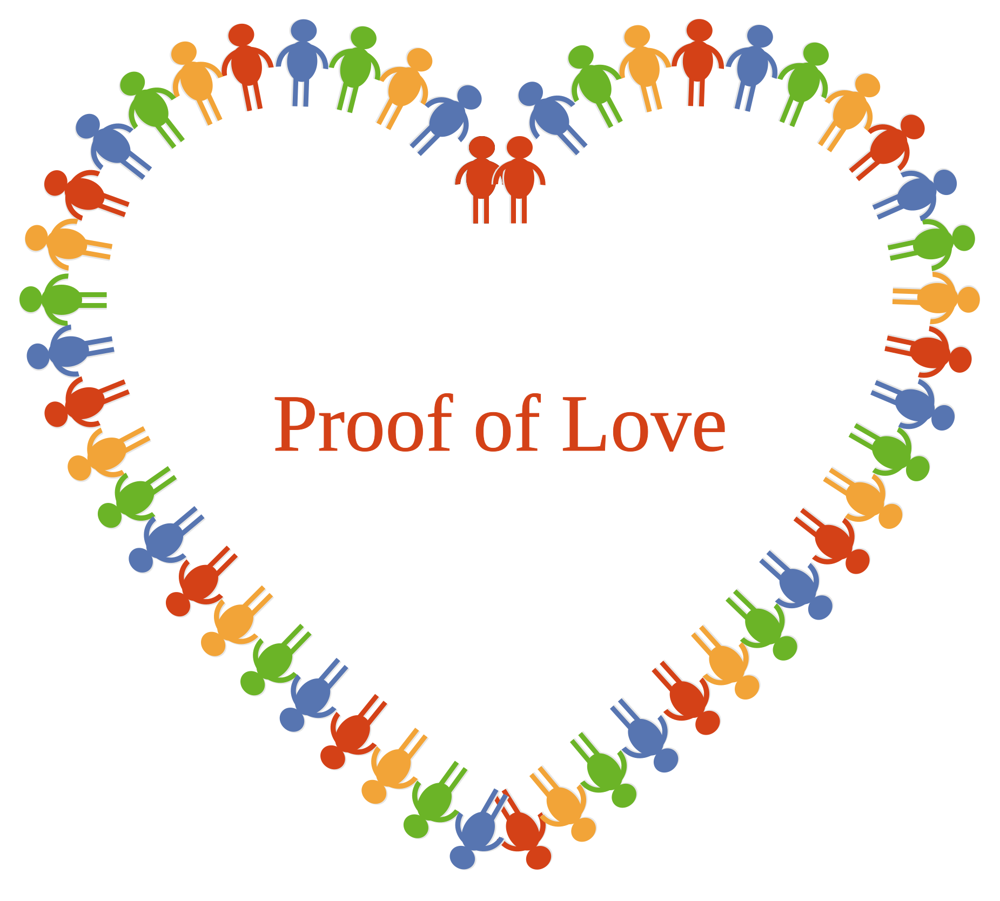

# Preface

Nearly two centuries ago, Karl Marx, with his profound insight, subjected the capitalist system—the pinnacle of humanity's old civilization—to an incisive critique, at the core of which lie alienation and reification. Marx pointed out that the worker's labor is alienated: its creativity, freedom, and life are turned into an external force that dominates the worker, so that individual freedom, self-realization, and even species-being are cruelly reified; the bourgeoisie, in its pursuit of profit and power, likewise falls into the alienation of its own mode of existence—it maintains the system through violence, only to be consumed by the bloody, species-hostile acts it unleashes, and the logic of capital and power reifies the ruling class itself, stripping it of control over its own actions and social relations. In this way, the social relations between human beings are thoroughly alienated and reified, becoming an objective force independent of human beings that dominates and distorts every individual.

Even more striking, Marx and Engels built on this foundation to jointly establish the theory of scientific communism, revealing the historical necessity that human society will ultimately move toward an era of public ownership that abolishes classes and exploitation. Within this theory, distribution according to need not only means the rational allocation of the means of consumption according to individuals' actual needs, but is more profoundly embodied in the comprehensive public provision of social resources such as education, healthcare, and public services. It takes as its premise public ownership of the means of production and the thorough abolition of class exploitation, achieves a fundamental restructuring of social relations, and thereby lays a solid institutional foundation for the free and all-round development of the human being.

This theory is an astonishingly bold vision in the history of human thought, providing for all later theories of social change a critical starting point and an ideal coordinate.

Marx believed that the society he envisioned was the truly human society, and that all the social forms that have appeared in our history so far are the prehistory of the truly human society. In other words, we have not yet reached the truly human society—because the relations among human beings still follow the ethical principles of the animal kingdom. The mutual antagonism of human beings against one another has brought humanity freedom over nature, but at a tremendous cost. The prehistory of human society will come to an end with the social form of capitalism! Marx said, In place of the old bourgeois society, with its classes and class antagonisms, we shall have an association, in which the free development of each is the condition for the free development of all. As long as a single person is unfree, there can be no freedom for humanity!

Yet Feuerbach's "species-being" (Gattungswesen), which Marx criticized as "abstract" from the perspective of historical materialism, is in fact an extremely profound humanist insight: in Feuerbach's vision, the human being is a "species-being" because the human horizon possesses universality—the whole of nature and human society alike can become objects of human cognition and contemplation. More crucially, the three powers of reason, will, and love constitute the inner essence of the human being. They are by no means the private possessions of individuals, but the universal essence shared by all humanity. It is precisely in the fusion of reason, will, and love that the individual comes to confirm his or her existence as a member of "humanity." Yet the "love" that Feuerbach understood essentially still remained at the level of sensible intuition and passive receptivity, lacking the dimension of practical action devoted to the external world—a limitation that not only laid the groundwork for Marx's subsequent critical "sublation" (Aufhebung), but also provided a crucial theoretical fulcrum for us to re-examine and reconstruct the complete structure of "love."

Because Marx overlooked the profundity of Feuerbach's theory of the "species-being," he was unable to provide answers sufficiently convincing to later generations on two fundamental questions: Why did humanity develop capitalism, a social form of extreme inequality? And what, in the end, is the ultimate force driving the ceaseless expansion of alienation and reification?

Moreover, although Marx and Engels both explored "whether humanity can make the transition to a better social form by peaceful means," they were never able to propose a reliable global solution.

Nearly two hundred years of social practice informed by Marxist thought, accompanied by the rapid development of science and technology—especially the recent explosive development of large language models, which represent human intelligence—has provided us with extremely rich inspiration and supplementary knowledge. This has enabled us, building on the foresight of predecessors such as Marx and Feuerbach, to continue digging into the essence of the governance of human civilization, and to transcendently propose a new consensus mechanism for the governance of the next human civilization: "Proof of Love"!

***Special note**: This book discusses only the main theory of "Proof of Love"; the details of governance will be constructed and implemented by a super-project, NaturalDAO.*
